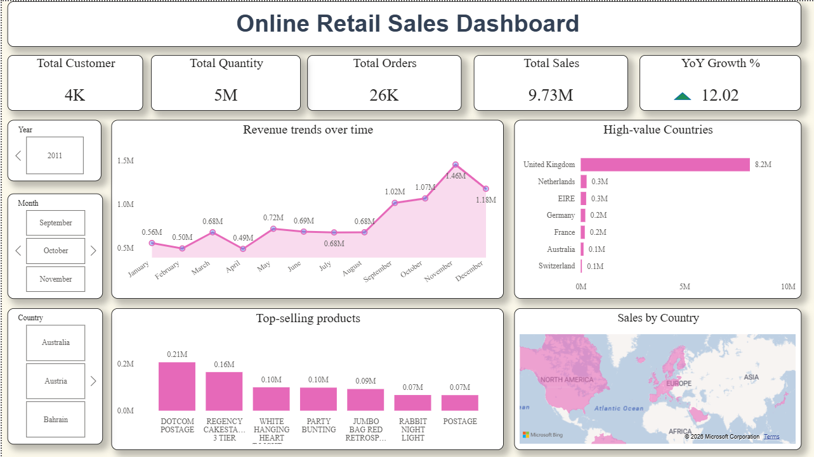

# 📊 Online Retail Sales Dashboard

An interactive **Power BI dashboard** built using an online retail dataset sourced from Kaggle.  
The project focuses on understanding **sales performance, customer activity, product performance, country-wise revenue, and year-over-year (YoY) growth**.

---

## 🚀 Project Overview

This project transforms raw retail transaction data into an interactive business intelligence dashboard.

The data was first **cleaned and transformed using Power Query Editor in Power BI**, followed by the creation of calculated metrics and interactive visualizations to identify important sales trends and business patterns.

### Project Flow

```text
Raw Kaggle Dataset
       ↓
Power Query
(Data Cleaning & Transformation)
       ↓
Power BI Data Model
       ↓
Measures / KPIs
       ↓
Interactive Dashboard
       ↓
Business Insights
```

---

## 🎯 Business Objectives

The dashboard was designed to answer questions such as:

- How much total sales revenue was generated?
- How many customers and orders are present?
- What is the total quantity sold?
- How are sales changing over time?
- What is the year-over-year growth?
- Which countries generate the highest sales?
- Which products are the top sellers?
- How does sales performance change based on year, month, and country?

---

## 🛠️ Tools & Technologies

- **Power BI**
- **Power Query Editor**
- **DAX**
- **Microsoft Bing Maps visual**
- **Kaggle Dataset**
- Data Cleaning & Transformation
- Data Visualization
- Business Intelligence / Sales Analytics

---

## 🧹 Data Cleaning & Transformation

The raw dataset was prepared in **Power Query Editor** before building the dashboard.

Typical preparation steps included:

- Reviewing column data types
- Cleaning and standardizing fields
- Handling missing/invalid values where required
- Removing unnecessary columns
- Preparing date-related fields
- Creating/deriving fields required for analysis
- Ensuring numeric fields were suitable for aggregation
- Preparing the dataset for Power BI visualizations

The objective was to convert the raw transactional data into a reliable analysis-ready dataset.

---

# 📈 Dashboard Features

## 1. Executive KPI Summary

The dashboard provides a quick overview through KPI cards:

- **Total Customers**
- **Total Quantity**
- **Total Orders**
- **Total Sales**
- **YoY Growth %**

These KPIs allow users to understand the overall business performance at a glance.

---

## 2. Revenue Trends Over Time

A monthly revenue trend visual shows how sales changed throughout the selected period.

This helps identify:

- High-performing months
- Low-performing months
- Seasonal patterns
- Changes in sales momentum

---

## 3. High-Value Countries

The dashboard highlights countries contributing the highest sales revenue.

This allows users to:

- Identify important geographic markets
- Compare country-level sales performance
- Understand where revenue is concentrated

---

## 4. Top-Selling Products

The dashboard displays the highest-performing products based on sales.

This helps identify:

- Products generating significant revenue
- Best-performing product SKUs
- Products that may require additional business attention

---

## 5. Sales by Country

An interactive map provides a geographic view of sales performance.

Users can visually explore the distribution of sales across different countries.

---

## 🎛️ Interactive Filters

The dashboard includes interactive slicers for:

- **Year**
- **Month**
- **Country**

These filters allow users to dynamically explore the dashboard and analyze sales performance for different time periods and markets.

---

# 📊 Key Metrics

### Total Sales

Measures the overall sales/revenue generated from the available transaction data.

### Total Orders

Represents the number of orders/transactions available for analysis.

### Total Quantity

Represents the total quantity of products sold.

### Total Customers

Represents the number of customers identified in the dataset.

### YoY Growth %

Measures the percentage change in sales compared with the previous year.

The basic calculation is:

```text
YoY Growth % =
(Current Year Sales - Previous Year Sales)
÷ Previous Year Sales × 100
```

---

# 💡 Key Insights

The dashboard can be used to identify insights such as:

•	Revenue grew approximately 12.02% year-over-year — the first quantified growth signal available in this dashboard.
•	Nearly 4,000 customers placed about 26,000 orders, generating total sales of $9.73M (~$374 per order, ~6–7 orders per customer).
•	Revenue is highly seasonal, with Q4 (Sep–Dec) contributing disproportionately and peaking in November at $1.46M.
•	The UK alone drives ~84% of total revenue; the map visual now makes this concentration visually obvious without reading a table.
•	Best-selling items remain low-cost, high-volume products rather than premium goods, indicating growth from purchase frequency     rather than big-ticket sales.


---

# 💼 Recommendations

1.	Remove non-product items ("Dotcom Postage", "Postage") from the Top-Selling Products chart so the ranking reflects real products only.
2.	Add a Profit Margin KPI once product cost data becomes available (Profit = Sales − Cost; Margin % = Profit / Sales) — sales volume alone does not indicate profitability.
3.	Reduce dependence on the UK market by running targeted campaigns in Netherlands, EIRE, Germany, and France, aiming to grow their combined share from under 4% to 10–12% over the next 2–3 quarters.
4.	Extend the peak season earlier — launch promotions in July–August to pull forward some of the Q4 demand and smooth revenue across the year.
5.	Introduce a repeat-customer loyalty program, since customers already average 6–7 orders per year — a lower-cost lever than acquiring new customers.

---

# 💼 Business Use Cases

This dashboard can support business teams in:

### Sales Planning
Understanding historical sales trends and identifying high-performing periods.

### Product Strategy
Identifying top-selling products and monitoring product performance.

### Geographic Expansion
Understanding which countries generate significant revenue.

### Performance Monitoring
Tracking KPIs and comparing current performance with previous periods.

### Management Reporting
Providing an interactive view of sales performance for business decision-making.

---

---

# 🖥️ Dashboard Preview



---

# 🔍 Project Highlights

- Cleaned and transformed raw retail data using **Power Query**
- Built an interactive **Power BI dashboard**
- Created business-focused KPIs
- Analyzed monthly revenue trends
- Performed country-wise sales analysis
- Identified top-selling products
- Added **YoY Growth %** for performance comparison
- Added interactive slicers for dynamic analysis
- Used geographic visualization for country-level sales analysis

---

# 📌 Conclusion

This updated dashboard represents a meaningful improvement over the previous version: it now answers "is the business growing?" with the YoY Growth KPI, and "where is the business concentrated?" with the new map visual — both of which were previously missing. The remaining gaps — non-product items in the top-sellers list and the absence of a profitability metric — are well defined and can be closed with the Power Query and DAX steps outlined above. With these final adjustments, the dashboard would be fully client-ready.

---

## 👨‍💻 Skills Demonstrated

`Power BI` `Power Query` `DAX` `Data Cleaning` `Data Transformation` `Data Visualization` `Business Intelligence` `Sales Analytics` `KPI Development` `Interactive Dashboard`

---

## 👨‍💻 Author

Narendra Kumar

